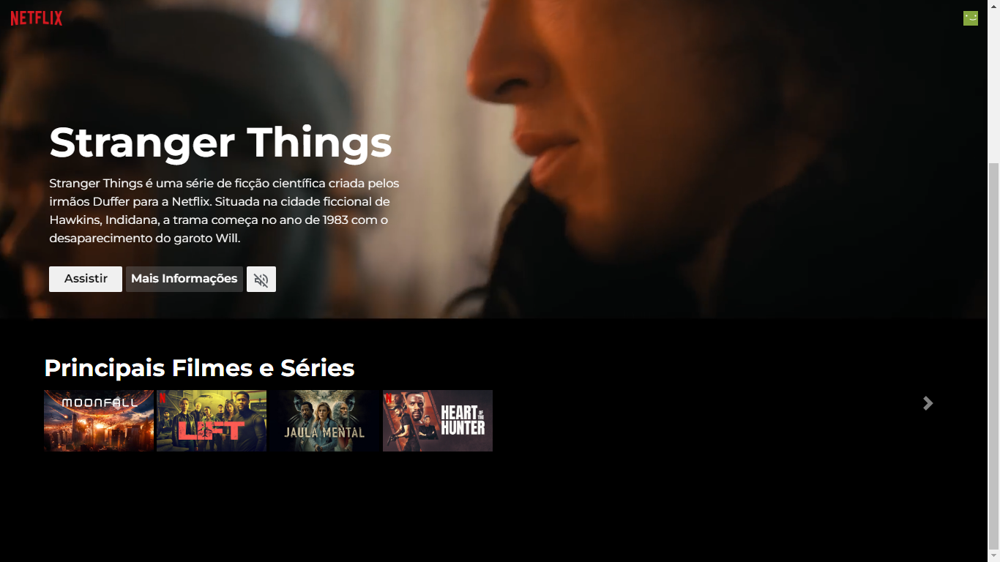

# Netflix Clone

Um clone da interface da Netflix desenvolvido com React.

## Tecnologias Utilizadas
- HTML5
- CSS3
- JavaScript

## Funcionalidades
- Exibição de filmes e séries populares
- Interface responsiva e semelhante à Netflix

